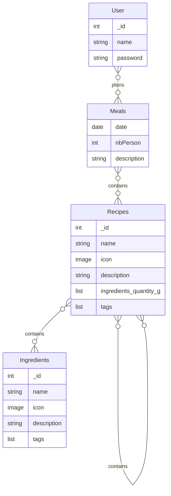

Here is the schema


In MongoDB here an example of document for each collection:

User:
```json
{
    "_id": 1,
    "name": "Jane",
    "password": "secret"
}
```

Meals:
```json
{
    "date": 2025-09-16,
    "nbPerson": 2,
    "description":"dinner for 2"
}
```

Recipes:
```json
 {
    "_id": 1,
    "name": "",
    "description": "",
    "ingredients_quantity_g":[
        {
            "ingredient": 1,
            "quatity_g": 5
        }
    ],
    "tags":["vegetarian"]
}
```

Ingredients:
```json
 {
    "_id": 1,
    "name": "",
    "description": "",
    "ingredientsIds":[2],
    "tags":[]
}
```

GroceryLists:
```json
{
    "_id": "607f1f77bcf86cd799439011",
    "user_id": "user-123",
    "created_at": "2025-11-01T12:00:00Z",
    "title": "Grocery 2025-11-01 — 2025-11-30",
    "period_start": "2025-11-01",
    "period_end": "2025-11-30",
    "items": [
        { "id": "it-1", "name": "Carrot", "qty": 1500, "unit": "g", "entries": ["Pancakes ×2: 1 kg"], "bought": false }
    ]
}
```
